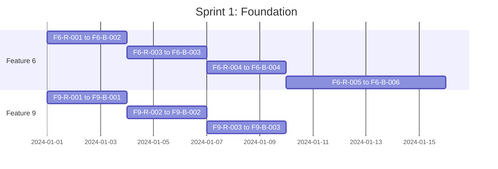
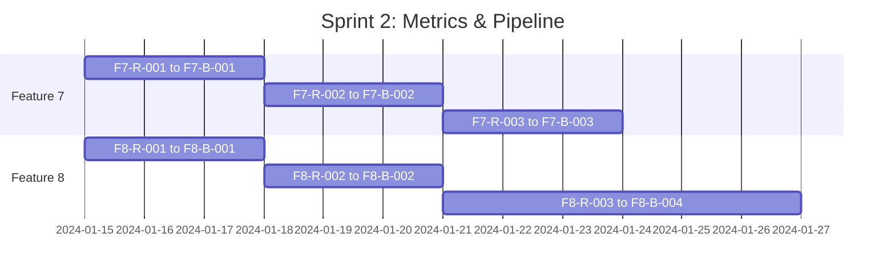
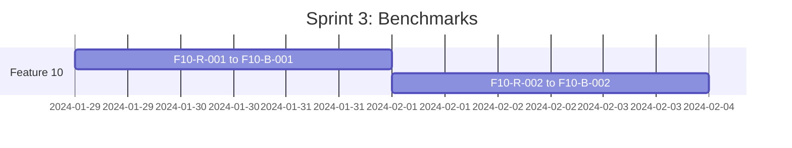

# IndexFoundry Phase 2: ZeroEntropy-Inspired Features

## Task Map & Implementation Roadmap

**Created**: 2025-12-25  
**Status**: Planning Complete  
**Total Estimated Tasks**: 45 TDD cycles (Red → Green → Blue)  
**Dependencies**: Phase 1 complete (336 passing tests)

---

## Executive Summary

Phase 2 implements ZeroEntropy's reranking-first philosophy with 5 features:

| Priority | Feature | Complexity | Est. Tasks | Parallel Safe |
|----------|---------|------------|------------|---------------|
| 🔴 P0 | Feature 6: Neural Reranking Pipeline | High | 12 | ✅ |
| 🟠 P1 | Feature 7: Retrieval Evaluation Metrics | Medium | 9 | ⚠️ After F6 core |
| 🟡 P2 | Feature 8: Hybrid Search → Rerank Workflow | Medium | 9 | ⚠️ After F6 |
| 🟢 P3 | Feature 9: Retrieval Feedback & Analytics | Low | 9 | ✅ |
| 🔵 P4 | Feature 10: Benchmark Suite | Medium | 6 | ⚠️ After F7 |

---

## Dependency Graph

```
┌─────────────────────────────────────────────────────────────┐
│                     Phase 2 Dependencies                     │
├─────────────────────────────────────────────────────────────┤
│                                                              │
│   Feature 6 ─────────┬──────────> Feature 8                 │
│   (Reranking)        │           (Workflow)                 │
│                      │                                       │
│                      └──────────> Feature 7 ────> Feature 10 │
│                                  (Metrics)       (Benchmarks)│
│                                                              │
│   Feature 9 ──────── (independent) ──────────────────────── │
│   (Feedback)                                                 │
│                                                              │
└─────────────────────────────────────────────────────────────┘
```

### Parallelization Strategy

**Wave 1** (can start immediately in parallel):
- Feature 6: Neural Reranking Pipeline
- Feature 9: Retrieval Feedback & Analytics

**Wave 2** (after Feature 6 core API is stable):
- Feature 7: Retrieval Evaluation Metrics
- Feature 8: Hybrid Search → Rerank Workflow

**Wave 3** (after Feature 7):
- Feature 10: Benchmark Suite

---

## Feature 6: Neural Reranking Pipeline

### Overview

**Objective**: Add a reranking stage after initial retrieval that re-scores candidates using cross-encoder models or similar approaches.

**Priority**: 🔴 P0 (Highest - Core ZeroEntropy insight)  
**Complexity**: High  
**Estimated TDD Cycles**: 12

### Integration Points

| File | Change Type | Description |
|------|-------------|-------------|
| [`src/schemas.ts`](../src/schemas.ts) | Add | `RerankOptionsSchema`, `RerankInputSchema` |
| [`src/types.ts`](../src/types.ts) | Add | `RerankResult`, `RerankModel`, `RerankCandidate` |
| [`src/tools/rerank.ts`](../src/tools/rerank.ts) | Create | New reranking tool implementation |
| [`src/tools/serve.ts`](../src/tools/serve.ts:1231) | Modify | Integrate reranking into `serveQuery()` |
| [`src/tools/projects.ts`](../src/tools/projects.ts:647) | Modify | Integrate reranking into `projectQuery()` |
| [`src/index.ts`](../src/index.ts) | Add | Register `indexfoundry_rerank` tool |
| [`tests/reranking.test.ts`](../tests/reranking.test.ts) | Create | Test suite for reranking |

### Schema Design

```typescript
// src/schemas.ts additions
export const RerankOptionsSchema = z.object({
  enabled: z.boolean().default(false)
    .describe("Enable neural reranking of search results"),
  model: z.enum([
    "cross-encoder/ms-marco-MiniLM-L-6-v2",  // Local/HuggingFace
    "cohere-rerank-v3",                       // Cohere API
    "voyage-rerank-2",                        // Voyage AI
    "custom"                                   // Custom endpoint
  ]).default("cross-encoder/ms-marco-MiniLM-L-6-v2")
    .describe("Reranker model to use"),
  top_k_to_rerank: z.number().int().min(10).max(200).default(50)
    .describe("Number of initial candidates to rerank"),
  top_k_final: z.number().int().min(1).max(100).default(10)
    .describe("Number of final results after reranking"),
  return_original_scores: z.boolean().default(false)
    .describe("Include original retrieval scores in results"),
  custom_endpoint: z.string().url().optional()
    .describe("Custom reranking API endpoint (when model='custom')"),
  api_key_env: z.string().default("RERANK_API_KEY")
    .describe("Environment variable containing reranker API key"),
}).strict();

export const RerankInputSchema = z.object({
  run_id: RunIdSchema.optional(),
  project_id: z.string().optional(),
  query: z.string().describe("Original query text"),
  candidates: z.array(z.object({
    chunk_id: z.string(),
    text: z.string(),
    original_score: z.number().optional(),
    metadata: z.record(z.unknown()).optional(),
  })).describe("Candidate chunks to rerank"),
  options: RerankOptionsSchema,
}).strict();
```

### Task Breakdown

#### 6.1 Core Reranking Infrastructure

| task_id | Phase | Objective | Mode | Dependencies | Acceptance Criteria |
|---------|-------|-----------|------|--------------|---------------------|
| `F6-R-001` | 🔴 Red | Define RerankOptionsSchema | red-phase | none | Tests fail: schema validation for all rerank options |
| `F6-G-001` | 🟢 Green | Implement RerankOptionsSchema | green-phase | F6-R-001 | Schema validates valid inputs, rejects invalid |
| `F6-B-001` | 🔵 Blue | Refactor schema with descriptive errors | blue-phase | F6-G-001 | Clear error messages, consistent with existing schemas |

| task_id | Phase | Objective | Mode | Dependencies | Acceptance Criteria |
|---------|-------|-----------|------|--------------|---------------------|
| `F6-R-002` | 🔴 Red | Define rerank types | red-phase | F6-B-001 | Tests fail: type definitions for RerankResult, RerankCandidate |
| `F6-G-002` | 🟢 Green | Implement rerank types | green-phase | F6-R-002 | Types compile, satisfy interface tests |
| `F6-B-002` | 🔵 Blue | Add JSDoc and type guards | blue-phase | F6-G-002 | Full documentation, type guard functions |

#### 6.2 Local Cross-Encoder Reranking

| task_id | Phase | Objective | Mode | Dependencies | Acceptance Criteria |
|---------|-------|-----------|------|--------------|---------------------|
| `F6-R-003` | 🔴 Red | Test local cross-encoder scoring | red-phase | F6-B-002 | Tests fail: score calculation, ordering |
| `F6-G-003` | 🟢 Green | Implement local cross-encoder | green-phase | F6-R-003 | Scores candidates, returns sorted results |
| `F6-B-003` | 🔵 Blue | Optimize scoring performance | blue-phase | F6-G-003 | Batch processing, caching, < 100ms for 50 candidates |

#### 6.3 API-Based Reranking (Cohere, Voyage)

| task_id | Phase | Objective | Mode | Dependencies | Acceptance Criteria |
|---------|-------|-----------|------|--------------|---------------------|
| `F6-R-004` | 🔴 Red | Test Cohere rerank API integration | red-phase | F6-B-002 | Tests fail: API call mocking, response parsing |
| `F6-G-004` | 🟢 Green | Implement Cohere rerank client | green-phase | F6-R-004 | Makes API calls, handles errors, parses responses |
| `F6-B-004` | 🔵 Blue | Add retry logic and rate limiting | blue-phase | F6-G-004 | Exponential backoff, rate limit handling |

#### 6.4 Integration with serveQuery and projectQuery

| task_id | Phase | Objective | Mode | Dependencies | Acceptance Criteria |
|---------|-------|-----------|------|--------------|---------------------|
| `F6-R-005` | 🔴 Red | Test rerank integration in serveQuery | red-phase | F6-B-003 | Tests fail: reranking option in query, result ordering |
| `F6-G-005` | 🟢 Green | Integrate reranking into serveQuery | green-phase | F6-R-005 | Query with rerank option returns reranked results |
| `F6-B-005` | 🔵 Blue | Add timing metrics and comparison scores | blue-phase | F6-G-005 | Results include timing, original vs reranked scores |

| task_id | Phase | Objective | Mode | Dependencies | Acceptance Criteria |
|---------|-------|-----------|------|--------------|---------------------|
| `F6-R-006` | 🔴 Red | Test rerank integration in projectQuery | red-phase | F6-B-005 | Tests fail: reranking in project context |
| `F6-G-006` | 🟢 Green | Integrate reranking into projectQuery | green-phase | F6-R-006 | Project queries support reranking |
| `F6-B-006` | 🔵 Blue | Unify rerank logic between serve/project | blue-phase | F6-G-006 | Shared rerank function, consistent behavior |

---

## Feature 7: Retrieval Evaluation Metrics

### Overview

**Objective**: Native evaluation metrics for retrieval quality (NDCG, MRR, Precision, Recall, MAP, Hit Rate).

**Priority**: 🟠 P1  
**Complexity**: Medium  
**Estimated TDD Cycles**: 9

### Integration Points

| File | Change Type | Description |
|------|-------------|-------------|
| [`src/schemas.ts`](../src/schemas.ts) | Add | `EvaluateRetrievalInputSchema` |
| [`src/types.ts`](../src/types.ts) | Add | `EvaluationResult`, `MetricValue`, `TestQuery` |
| [`src/tools/evaluate.ts`](../src/tools/evaluate.ts) | Create | Evaluation tool implementation |
| [`src/index.ts`](../src/index.ts) | Add | Register `indexfoundry_evaluate_retrieval` tool |
| [`tests/evaluation-metrics.test.ts`](../tests/evaluation-metrics.test.ts) | Create | Test suite for metrics |

### Schema Design

```typescript
export const EvaluateRetrievalInputSchema = z.object({
  run_id: RunIdSchema.optional(),
  project_id: z.string().optional(),
  test_queries: z.array(z.object({
    query_id: z.string().optional(),
    query: z.string().describe("Test query text"),
    relevant_ids: z.array(z.string())
      .describe("Chunk IDs that are relevant to this query"),
    relevance_scores: z.array(z.number().min(0).max(3)).optional()
      .describe("Graded relevance: 0=not, 1=marginal, 2=relevant, 3=highly"),
  })).min(1).describe("Test queries with expected relevant documents"),
  retriever_config: z.object({
    top_k: z.number().int().min(1).max(100).default(10),
    mode: z.enum(["semantic", "keyword", "hybrid"]).default("hybrid"),
    rerank: z.boolean().default(false),
    rerank_options: RerankOptionsSchema.optional(),
  }),
  metrics: z.array(z.enum([
    "ndcg",       // Normalized Discounted Cumulative Gain
    "mrr",        // Mean Reciprocal Rank
    "precision",  // Precision@K
    "recall",     // Recall@K
    "map",        // Mean Average Precision
    "hit_rate",   // At least one relevant in top-K
  ])).default(["ndcg", "mrr", "precision", "recall"]),
  k_values: z.array(z.number().int().min(1).max(100))
    .default([1, 3, 5, 10, 20])
    .describe("K values to compute metrics at"),
}).strict();
```

### Task Breakdown

#### 7.1 Metric Calculation Functions

| task_id | Phase | Objective | Mode | Dependencies | Acceptance Criteria |
|---------|-------|-----------|------|--------------|---------------------|
| `F7-R-001` | 🔴 Red | Test NDCG calculation | red-phase | F6-B-006 | Tests fail: NDCG@K for various K values |
| `F7-G-001` | 🟢 Green | Implement NDCG calculation | green-phase | F7-R-001 | Correct NDCG scores for test cases |
| `F7-B-001` | 🔵 Blue | Optimize NDCG with caching | blue-phase | F7-G-001 | DCG cache, batch computation |

| task_id | Phase | Objective | Mode | Dependencies | Acceptance Criteria |
|---------|-------|-----------|------|--------------|---------------------|
| `F7-R-002` | 🔴 Red | Test MRR, Precision, Recall, MAP | red-phase | F7-B-001 | Tests fail: all metric calculations |
| `F7-G-002` | 🟢 Green | Implement remaining metrics | green-phase | F7-R-002 | All metrics compute correctly |
| `F7-B-002` | 🔵 Blue | Create unified metric interface | blue-phase | F7-G-002 | Single `computeMetric(name, results, relevance)` function |

#### 7.2 Evaluation Tool

| task_id | Phase | Objective | Mode | Dependencies | Acceptance Criteria |
|---------|-------|-----------|------|--------------|---------------------|
| `F7-R-003` | 🔴 Red | Test evaluateRetrieval tool | red-phase | F7-B-002 | Tests fail: end-to-end evaluation |
| `F7-G-003` | 🟢 Green | Implement evaluateRetrieval | green-phase | F7-R-003 | Runs queries, computes metrics, returns report |
| `F7-B-003` | 🔵 Blue | Add comparison mode (with/without rerank) | blue-phase | F7-G-003 | A/B comparison, delta calculations |

---

## Feature 8: Hybrid Search → Rerank Workflow

### Overview

**Objective**: Orchestrated pipeline that combines keyword + semantic search, then reranks.

**Priority**: 🟡 P2  
**Complexity**: Medium  
**Estimated TDD Cycles**: 9

### Integration Points

| File | Change Type | Description |
|------|-------------|-------------|
| [`src/schemas.ts`](../src/schemas.ts) | Add | `HybridRerankPipelineInputSchema` |
| [`src/types.ts`](../src/types.ts) | Add | `PipelineStage`, `PipelineResult`, `AblationConfig` |
| [`src/tools/pipeline.ts`](../src/tools/pipeline.ts) | Create | Pipeline orchestration |
| [`src/index.ts`](../src/index.ts) | Add | Register `indexfoundry_hybrid_rerank` tool |
| [`tests/hybrid-rerank-pipeline.test.ts`](../tests/hybrid-rerank-pipeline.test.ts) | Create | Test suite |

### Schema Design

```typescript
export const HybridRerankPipelineInputSchema = z.object({
  run_id: RunIdSchema.optional(),
  project_id: z.string().optional(),
  query: z.string().describe("Search query"),
  query_vector: z.array(z.number()).optional()
    .describe("Pre-computed query embedding"),
  
  // Stage 1: Initial Retrieval
  initial_retrieval: z.object({
    keyword_top_k: z.number().int().default(50),
    semantic_top_k: z.number().int().default(50),
    parallel: z.boolean().default(true)
      .describe("Run keyword and semantic in parallel"),
  }).default({}),
  
  // Stage 2: Fusion
  fusion: z.object({
    method: z.enum(["rrf", "weighted_sum", "max_score"]).default("rrf"),
    rrf_k: z.number().int().default(60),
    semantic_weight: z.number().min(0).max(1).default(0.7),
  }).default({}),
  
  // Stage 3: Reranking
  rerank: RerankOptionsSchema.extend({
    enabled: z.boolean().default(true),
  }).default({ enabled: true }),
  
  // Stage 4: Final Output
  output: z.object({
    top_k: z.number().int().min(1).max(100).default(10),
    include_stage_scores: z.boolean().default(false),
    include_timing: z.boolean().default(true),
  }).default({}),
  
  // Ablation mode
  ablation: z.object({
    enabled: z.boolean().default(false),
    compare_modes: z.array(z.enum([
      "keyword_only",
      "semantic_only", 
      "hybrid_no_rerank",
      "hybrid_with_rerank"
    ])).default(["hybrid_no_rerank", "hybrid_with_rerank"]),
  }).optional(),
}).strict();
```

### Task Breakdown

#### 8.1 Pipeline Stages

| task_id | Phase | Objective | Mode | Dependencies | Acceptance Criteria |
|---------|-------|-----------|------|--------------|---------------------|
| `F8-R-001` | 🔴 Red | Test parallel keyword/semantic retrieval | red-phase | F6-B-006 | Tests fail: parallel execution, result merging |
| `F8-G-001` | 🟢 Green | Implement parallel initial retrieval | green-phase | F8-R-001 | Runs both searches in parallel, merges results |
| `F8-B-001` | 🔵 Blue | Add cancellation and timeout handling | blue-phase | F8-G-001 | Graceful timeout, partial results |

| task_id | Phase | Objective | Mode | Dependencies | Acceptance Criteria |
|---------|-------|-----------|------|--------------|---------------------|
| `F8-R-002` | 🔴 Red | Test fusion methods (RRF, weighted) | red-phase | F8-B-001 | Tests fail: fusion algorithm correctness |
| `F8-G-002` | 🟢 Green | Implement fusion methods | green-phase | F8-R-002 | All fusion methods produce correct ordering |
| `F8-B-002` | 🔵 Blue | Optimize fusion performance | blue-phase | F8-G-002 | O(n log n) fusion, minimal allocations |

#### 8.2 Pipeline Orchestration

| task_id | Phase | Objective | Mode | Dependencies | Acceptance Criteria |
|---------|-------|-----------|------|--------------|---------------------|
| `F8-R-003` | 🔴 Red | Test full pipeline execution | red-phase | F8-B-002 | Tests fail: end-to-end pipeline |
| `F8-G-003` | 🟢 Green | Implement pipeline orchestrator | green-phase | F8-R-003 | Pipeline executes all stages in order |
| `F8-B-003` | 🔵 Blue | Add stage timing and logging | blue-phase | F8-G-003 | Per-stage timing, structured logs |

#### 8.3 Ablation Mode

| task_id | Phase | Objective | Mode | Dependencies | Acceptance Criteria |
|---------|-------|-----------|------|--------------|---------------------|
| `F8-R-004` | 🔴 Red | Test ablation comparison | red-phase | F8-B-003 | Tests fail: A/B comparison output |
| `F8-G-004` | 🟢 Green | Implement ablation mode | green-phase | F8-R-004 | Runs multiple modes, compares results |
| `F8-B-004` | 🔵 Blue | Add visualization-ready output | blue-phase | F8-G-004 | JSON output for comparison charts |

---

## Feature 9: Retrieval Feedback & Analytics

### Overview

**Objective**: Collect and analyze retrieval quality signals over time.

**Priority**: 🟢 P3  
**Complexity**: Low  
**Estimated TDD Cycles**: 9

### Integration Points

| File | Change Type | Description |
|------|-------------|-------------|
| [`src/schemas.ts`](../src/schemas.ts) | Add | `LogFeedbackInputSchema`, `GetAnalyticsInputSchema` |
| [`src/types.ts`](../src/types.ts) | Add | `FeedbackRecord`, `AnalyticsReport` |
| [`src/tools/analytics.ts`](../src/tools/analytics.ts) | Create | Analytics tool implementation |
| [`src/index.ts`](../src/index.ts) | Add | Register feedback/analytics tools |
| [`tests/analytics.test.ts`](../tests/analytics.test.ts) | Create | Test suite |

### Schema Design

```typescript
export const LogFeedbackInputSchema = z.object({
  run_id: RunIdSchema.optional(),
  project_id: z.string().optional(),
  query_id: z.string().uuid().describe("Unique query identifier"),
  query_text: z.string().describe("Original query"),
  selected_chunk_ids: z.array(z.string())
    .describe("Chunk IDs user clicked/used"),
  feedback_type: z.enum(["positive", "negative", "none"]).default("none")
    .describe("Explicit user feedback"),
  retrieval_config: z.object({
    mode: z.string(),
    top_k: z.number(),
    rerank_enabled: z.boolean(),
  }).optional(),
  metadata: z.record(z.unknown()).optional(),
}).strict();

export const GetAnalyticsInputSchema = z.object({
  run_id: RunIdSchema.optional(),
  project_id: z.string().optional(),
  time_range: z.object({
    start: z.string().datetime(),
    end: z.string().datetime(),
  }).optional(),
  group_by: z.enum(["hour", "day", "week", "query_pattern"]).default("day"),
  metrics: z.array(z.enum([
    "query_count",
    "avg_selected_rank",
    "feedback_rate",
    "click_through_rate",
    "rerank_improvement",
  ])).default(["query_count", "avg_selected_rank", "feedback_rate"]),
}).strict();
```

### Task Breakdown

#### 9.1 Feedback Logging

| task_id | Phase | Objective | Mode | Dependencies | Acceptance Criteria |
|---------|-------|-----------|------|--------------|---------------------|
| `F9-R-001` | 🔴 Red | Test feedback logging | red-phase | none | Tests fail: feedback record creation |
| `F9-G-001` | 🟢 Green | Implement logFeedback tool | green-phase | F9-R-001 | Logs feedback to JSONL file |
| `F9-B-001` | 🔵 Blue | Add feedback validation and dedup | blue-phase | F9-G-001 | Validates records, prevents duplicates |

#### 9.2 Analytics Aggregation

| task_id | Phase | Objective | Mode | Dependencies | Acceptance Criteria |
|---------|-------|-----------|------|--------------|---------------------|
| `F9-R-002` | 🔴 Red | Test analytics aggregation | red-phase | F9-B-001 | Tests fail: time-series aggregation |
| `F9-G-002` | 🟢 Green | Implement getAnalytics tool | green-phase | F9-R-002 | Aggregates feedback by time period |
| `F9-B-002` | 🔵 Blue | Add streaming aggregation | blue-phase | F9-G-002 | Memory-efficient for large datasets |

#### 9.3 Query Pattern Detection

| task_id | Phase | Objective | Mode | Dependencies | Acceptance Criteria |
|---------|-------|-----------|------|--------------|---------------------|
| `F9-R-003` | 🔴 Red | Test poor-performing query detection | red-phase | F9-B-002 | Tests fail: pattern identification |
| `F9-G-003` | 🟢 Green | Implement query pattern analysis | green-phase | F9-R-003 | Identifies queries with low CTR/feedback |
| `F9-B-003` | 🔵 Blue | Add improvement recommendations | blue-phase | F9-G-003 | Suggests index/config improvements |

---

## Feature 10: Benchmark Suite

### Overview

**Objective**: Create reusable benchmark datasets for evaluating retrieval quality.

**Priority**: 🔵 P4  
**Complexity**: Medium  
**Estimated TDD Cycles**: 6

### Integration Points

| File | Change Type | Description |
|------|-------------|-------------|
| [`src/schemas.ts`](../src/schemas.ts) | Add | `BenchmarkSchema`, `RunBenchmarkInputSchema` |
| [`src/types.ts`](../src/types.ts) | Add | `Benchmark`, `BenchmarkResult`, `BenchmarkQuery` |
| [`src/tools/benchmark.ts`](../src/tools/benchmark.ts) | Create | Benchmark tool implementation |
| [`src/index.ts`](../src/index.ts) | Add | Register benchmark tools |
| [`tests/benchmark.test.ts`](../tests/benchmark.test.ts) | Create | Test suite |

### Schema Design

```typescript
export const BenchmarkSchema = z.object({
  benchmark_id: z.string().describe("Unique benchmark identifier"),
  name: z.string().describe("Human-readable name"),
  description: z.string().optional(),
  domain: z.string().describe("Domain: legal, technical, medical, general"),
  version: z.string().default("1.0.0"),
  created_at: z.string().datetime(),
  queries: z.array(z.object({
    query_id: z.string(),
    query: z.string(),
    expected_chunks: z.array(z.object({
      chunk_id: z.string(),
      relevance: z.number().int().min(0).max(3)
        .describe("0=irrelevant, 1=marginal, 2=relevant, 3=highly"),
    })),
    difficulty: z.enum(["easy", "medium", "hard"]).optional(),
    category: z.string().optional(),
  })),
}).strict();

export const RunBenchmarkInputSchema = z.object({
  benchmark_id: z.string(),
  run_id: RunIdSchema.optional(),
  project_id: z.string().optional(),
  retriever_configs: z.array(z.object({
    name: z.string().describe("Config name for comparison"),
    mode: z.enum(["semantic", "keyword", "hybrid"]),
    top_k: z.number().int().default(10),
    rerank: z.boolean().default(false),
    rerank_options: RerankOptionsSchema.optional(),
  })).min(1).describe("Retriever configurations to compare"),
  output_format: z.enum(["json", "csv", "markdown"]).default("json"),
}).strict();
```

### Task Breakdown

#### 10.1 Benchmark Management

| task_id | Phase | Objective | Mode | Dependencies | Acceptance Criteria |
|---------|-------|-----------|------|--------------|---------------------|
| `F10-R-001` | 🔴 Red | Test benchmark CRUD operations | red-phase | F7-B-003 | Tests fail: create, read, list benchmarks |
| `F10-G-001` | 🟢 Green | Implement benchmark management | green-phase | F10-R-001 | Benchmarks stored/retrieved correctly |
| `F10-B-001` | 🔵 Blue | Add benchmark validation | blue-phase | F10-G-001 | Validates chunk IDs exist, no duplicates |

#### 10.2 Benchmark Execution

| task_id | Phase | Objective | Mode | Dependencies | Acceptance Criteria |
|---------|-------|-----------|------|--------------|---------------------|
| `F10-R-002` | 🔴 Red | Test benchmark execution | red-phase | F10-B-001 | Tests fail: running benchmark, collecting results |
| `F10-G-002` | 🟢 Green | Implement runBenchmark | green-phase | F10-R-002 | Runs all queries, computes metrics per config |
| `F10-B-002` | 🔵 Blue | Add progress reporting and export | blue-phase | F10-G-002 | Progress callback, CSV/Markdown export |

---

## Files Summary

### New Files to Create

| File | Feature | Description |
|------|---------|-------------|
| `src/tools/rerank.ts` | F6 | Neural reranking implementation |
| `src/tools/evaluate.ts` | F7 | Retrieval evaluation metrics |
| `src/tools/pipeline.ts` | F8 | Hybrid→Rerank workflow orchestration |
| `src/tools/analytics.ts` | F9 | Feedback logging and analytics |
| `src/tools/benchmark.ts` | F10 | Benchmark suite management |
| `tests/reranking.test.ts` | F6 | Reranking test suite |
| `tests/evaluation-metrics.test.ts` | F7 | Evaluation metrics tests |
| `tests/hybrid-rerank-pipeline.test.ts` | F8 | Pipeline tests |
| `tests/analytics.test.ts` | F9 | Analytics tests |
| `tests/benchmark.test.ts` | F10 | Benchmark tests |

### Files to Modify

| File | Features | Changes |
|------|----------|---------|
| [`src/schemas.ts`](../src/schemas.ts) | All | Add all new schemas |
| [`src/types.ts`](../src/types.ts) | All | Add all new types |
| [`src/index.ts`](../src/index.ts) | All | Register all new tools |
| [`src/tools/serve.ts`](../src/tools/serve.ts:1231) | F6, F8 | Integrate reranking |
| [`src/tools/projects.ts`](../src/tools/projects.ts:647) | F6, F8 | Integrate reranking |

---

## Complexity Estimates

| Feature | Schema | Logic | Integration | Testing | Total |
|---------|--------|-------|-------------|---------|-------|
| F6: Reranking | Medium | High | High | High | **High** |
| F7: Metrics | Low | Medium | Low | Medium | **Medium** |
| F8: Pipeline | Medium | Medium | Medium | Medium | **Medium** |
| F9: Analytics | Low | Low | Low | Medium | **Low** |
| F10: Benchmark | Medium | Low | Low | Medium | **Medium** |

---

## Implementation Order

### Sprint 1: Foundation (Tasks 1-18)

**Objective**: Core reranking and independent analytics



### Sprint 2: Metrics & Pipeline (Tasks 19-36)

**Objective**: Evaluation metrics and workflow orchestration



### Sprint 3: Benchmarks (Tasks 37-42)

**Objective**: Benchmark suite for systematic evaluation



---

## Success Criteria

### Phase 2 Completion

- [ ] All 45 TDD cycles complete (Red → Green → Blue)
- [ ] All new tests passing (estimated +150 tests)
- [ ] No regressions in existing 336 tests
- [ ] Documentation updated for all new tools
- [ ] Example usage in README for each feature

### Quality Gates

1. **Code Coverage**: Maintain >80% coverage
2. **Performance**: Reranking adds <100ms for 50 candidates
3. **API Compatibility**: All existing tools unchanged
4. **Schema Validation**: All inputs validated with clear errors

---

## Notes for Orchestrator

### Parallel Execution Safety

- Features 6 and 9 have no shared files beyond schemas/types (safe to parallelize)
- Use file-pattern isolation:
  - F6 Worker: `src/tools/rerank.ts`, `tests/reranking.test.ts`
  - F9 Worker: `src/tools/analytics.ts`, `tests/analytics.test.ts`

### Dependency Management

- Feature 7 and 8 should NOT start until F6-B-006 is complete
- Feature 10 should NOT start until F7-B-003 is complete

### Risk Mitigation

- Local cross-encoder may require optional dependency (`@xenova/transformers`)
- API-based reranking requires API key handling
- Consider fallback to no-rerank if model unavailable
